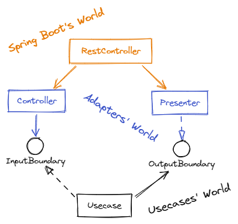

# Hangman
This project is a Rest API to play hangman. This context must allow me to try to realize a side project by using the clean architecture, the contract first development and TDD with 100% code coverage. It's a ambitious target but I like to think, it's a success :)

## Clean Architecture

The Clean Architecture is defined by Robert C. Martin (aka Uncle Bob) and I advise you to read his blog article about it: https://blog.cleancoder.com/uncle-bob/2012/08/13/the-clean-architecture.html. My implementation modelizes the controller and the presenter as 2 differents classes outside of Spring Boot framework classes. In the examples, that we could find, modelizes the presenter as the return type of the controller call. This is a mistake and I advice you to read this detailed explicatio by Jeremiah Flaga: https://softwareengineering.stackexchange.com/questions/357052/clean-architecture-use-case-containing-the-presenter-or-returning-data. Another mistake is to believe that the controller is a framework 'controller' class like in all MVC framework. Another article, by Tobias Strandberg, to understand this controller confusion: https://adevelopersdiscourse.blogspot.com/2020/06/clean-architecture-demystified.html.

### Implementation with Spring Boot
Controller and presenter are adapter classes. Controller calls the interactor ('usecase' in my project's nomenclature) through the InputBoundary interface. Usecase calls the presenter through the OutputBoundary. It provides the result of the processing to the Presenter. The presenter transforms the result into a DTO. Finally, the Rest controller calls the controller to process the action and then reads the response from the presenter.

The presenter is stateful because it stores the DTO but the Rest Controller is stateless. I choose to provide controller and presenter at the instantiation of the Rest controller. Just annotate the presenter with `@RequestScope` allows to solve this problem.
https://github.com/CedN/hangman/blob/f180d630b1a8e6e6a037c6a9d295fef728552771/hangman-api/src/main/java/cna/apps/hangman/tech/ApplicationConfiguration.java#L42-L46

#### Links
* Robert C. Martin's blog: https://blog.cleancoder.com/
* Tobias Strandberg's blog: https://adevelopersdiscourse.blogspot.com/
* Jeremiah Flaga's blog https://jeremiahflaga.github.io/

 